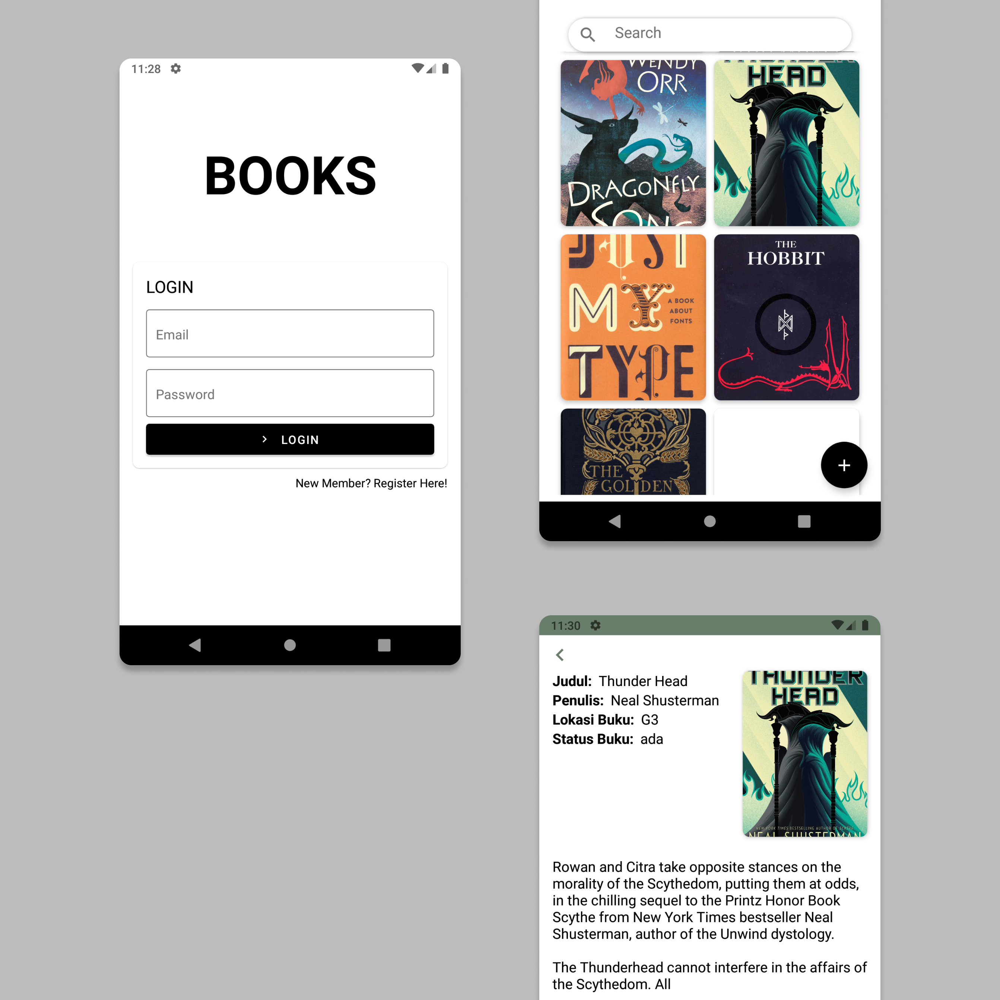

<div align=center>

</div>

# Simple Library Management Mobile Version
##### Make with :boom: and [React Native](https://facebook.github.io/react-native/)

## Installation
```
 $ git clone https://github.com/Drzaln/Simple-Library-Management-MobileVersion.git

 $ npm install

 $ react-native run-android
 ```
 or
 ```
 $ react-native run-ios
 ```

 ## Screenshot

 

 ## Related Project
 
In this repository only for the mobile section, for the backend section can be seen [here](https://github.com/Drzaln/simple-library-management-backend-).
And for the web version can be seen [here](https://github.com/Drzaln/simple-library-management-frontend-).


- ##### Follow [this link](https://dev.to/zilurrane/generate-release-mode-apk-for-react-native-project-to-publish-on-playstore-5f78) to generate this project to APK file.

- ##### Follow [this link](https://www.freecodecamp.org/news/how-to-add-app-icons-and-splash-screens-to-a-react-native-app-in-staging-and-production-d1dab615e7c6/) to add app icon and splash screen to your React Native project file.